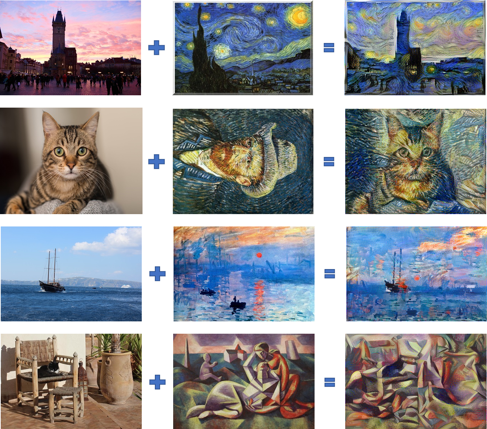

# Neural_Style_Transfer_Learning
AI learns painting from a masterpiece.

This is an implementation of the "[A Neural Algorithm of Artistic Style](http://arxiv.org/abs/1508.06576)". This uses the selected filtered responses of a pre-trained model (VGG-19) to capture low level to high level features and transfer them to the content image.

You can have a quick look what this code can do from my IPython Notebook available [here](./Neural_style_transfer_art_images_Lei.ipynb)

Demos:

# How to run

You will need to install dependencies:

- TensorFlow v1
- Scipy
- Numpy

You will need to download the [VGG-19 model](http://www.vlfeat.org/matconvnet/models/imagenet-vgg-verydeep-19.mat).

Then you can either run Neural_Style_Transfer.py or run IPython Notebook Neural_style_transfer_art_images_Lei.ipynb

References:
- [A Neural Algorithm of Artistic Style](http://arxiv.org/abs/1508.06576)
- [My AI open course homework](./Art_Generation_with_Neural_Style_Transfer_v3a_solution.ipynb)

